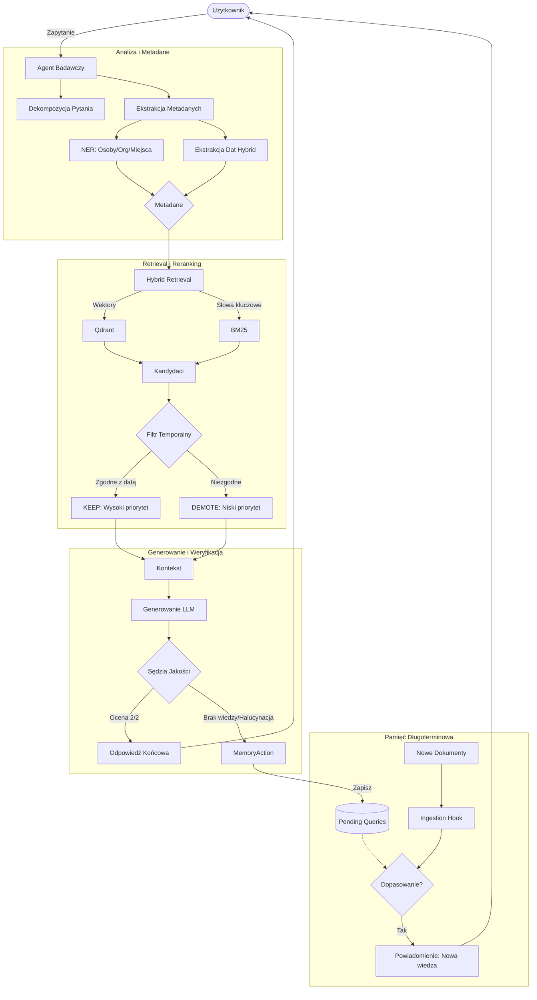

# Modular Research Agent & RAG System

Projekt systemu **Retrieval-Augmented Generation (RAG)** przekształcony w autonomicznego **Agenta Badawczego**, realizowany w ramach laboratorium Przetwarzania Języka Naturalnego (PJN). System charakteryzuje się modularną architekturą, hybrydowym wyszukiwaniem, świadomością czasu (temporal logic) oraz mechanizmem samouczenia (active memory).

## Architektura logiczna Agenta

Poniższy diagram przedstawia przepływ sterowania w finalnym prototypie Agenta Badawczego:



## Główne Funkcjonalności

* **Agent Badawczy:** Orkiestrator procesu, który dynamicznie decyduje o dekompozycji pytania i strategii wyszukiwania.
* **Logika Temporalna (Agent Czasu):** System rozumie kontekst czasowy (np. "po 2020 roku") i degraduje ranking dokumentów nieaktualnych.
* **Wzbogacanie Metadanych (NER + Daty):**
* **NER:** Wykorzystanie modelu `Babelscape/wikineural` do ekstrakcji osób i organizacji.
* **Daty:** Hybrydowa metoda (RegExp + LLM) do precyzyjnego ustalania ram czasowych.


* **Quality Loop (Pętla Jakości):** Automatyczny "Sędzia LLM" oceniający odpowiedź w skali 0-2 przed wysłaniem jej do użytkownika.
* **Pamięć Aktywna (Knowledge Accumulation):** System zapamiętuje nierozwiązane pytania i automatycznie do nich wraca, gdy w bazie pojawią się nowe, pasujące dokumenty.
* **Hybrydowy Retrieval:** Połączenie Qdrant i Elasticsearch z algorytmem RRF.

## Struktura projektu

```text
├── research_agent.py          # [NEW] Główny Agent Badawczy (Orchestrator)
├── rag_temporal_logic.py      # [NEW] Logika filtracji czasowej i rerankingu
├── rag_query_with_metadata.py # [NEW] Implementacja RAG z Quality Loop
├── main.py                    # Serwer FastAPI
├── config.py                  # Konfiguracja (modele, ścieżki)
├── rag_query.py               # [OLD]
├── retrieval/              
│   ├── fusion.py              # Implementacja RRF
│   ├── elastic.py             
│   └── qdrant.py              
├── reasoning/              
│   ├── validation.py          # Walidacja cytatów
│   ├── prompt.py              # Szablony promptów
│   └── chunking.py            
├── data/               
│   ├── create_indices.py      # [UPDATED] Indeksowanie z metadanymi (NER/Daty)
│   ├── ner_extraction.py      # [NEW] Obsługa modelu NER HuggingFace
│   ├── benchmark.jsonl        # Zbiór testowy
│   ├── date_extraction_hybrid.py  # [NEW] Ekstrakcja dat (RegEx + LLM)
├── experiments/ 
│   ├── ner_experiment.py
│   ├── run_nlp_experiment.py
└── memory/
	├── memory_manager.py          # [NEW] Zarządzanie pamięcią i "Ingestion Hook"
    └── pending.json            # Baza pytań oczekujących
	

```

## Uruchomienie

### Wymagania

* Python 3.10+
* Ollama (Llama 3.1: 8B)
* Docker (dla Qdrant i Elasticsearch)

### Instalacja i start

1. **Instalacja zależności:**
```bash
pip install fastapi uvicorn pydantic openai qdrant-client elasticsearch transformers torch

```


2. **Uruchomienie Agenta (CLI):**
```bash
python research_agent.py

```


3. **Uruchomienie API:**
```bash
uvicorn main:app --reload

```


## Przykłady działania (Scenariusze)

1. **Pytanie historyczne:** *"Kto i kiedy wprowadził LSTM?"*
* Agent wykrywa datę i encję -> Znajduje dokument z 1997 roku -> **Sukces (Ocena 2/2)**.


2. **Pytanie o przyszłość:** *"Jakie modele powstały po 2026 roku?"*
* Filtr temporalny odrzuca dokumenty sprzed 2026 -> Brak wiedzy -> **Zapis do pamięci**.


3. **Nowa wiedza:**
* Dodanie dokumentu o "GPT-7 (2027)" -> **Agent wysyła powiadomienie**, że zna odpowiedź na poprzednie pytanie.


---

Autor projektu: Klaudia Stodółkiewicz
Materiały źródłowe: Wykłady dr. Aleksandra Smywińskiego-Pohla oraz mgr. Magdaleny Król, opracowania mgr. Jakuba Adamczyka.